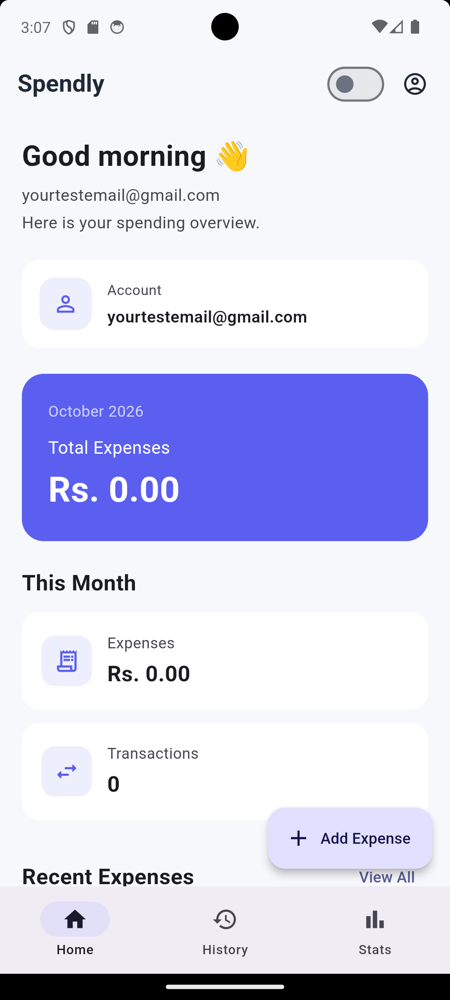
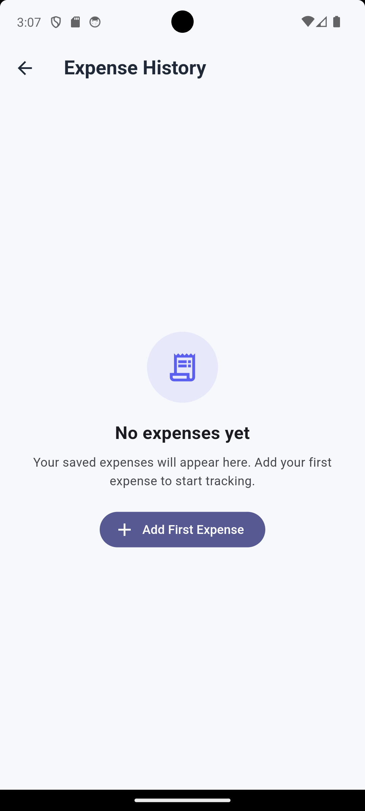
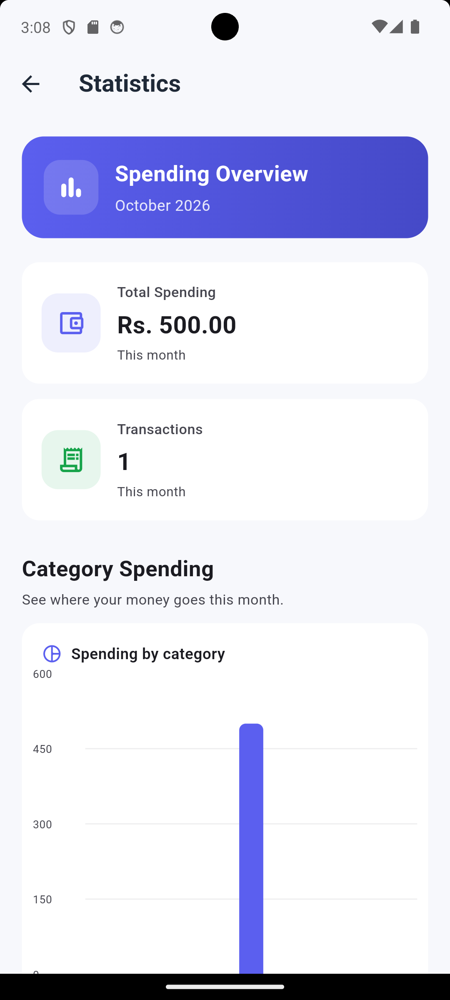
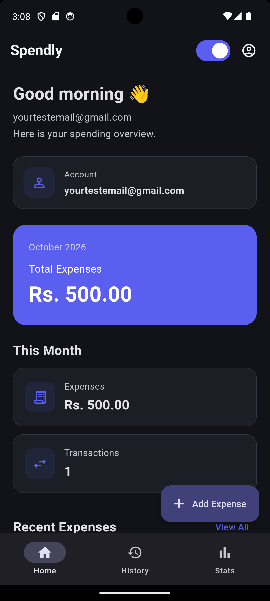

# Spendly — Flutter Expense Tracker

A modern personal expense tracking mobile application built with **Flutter, Dart, Firebase Authentication, and Cloud Firestore**.

Spendly helps users securely record, manage, search, filter, and analyze their expenses through a clean and responsive interface.

> Developed as part of the CyphLab Flutter Expense App assignment.

---

## 📱 Features

### 🔐 Authentication

* Firebase Email/Password authentication
* User registration
* User login
* Logout
* Firebase authentication error handling
* Password visibility toggle

### 💰 Expense Management

* Add expenses
* Edit existing expenses
* Delete expenses
* Expense title
* Amount
* Category
* Date
* Optional notes
* Form validation
* Loading and saving states

### 📋 Expense History

* View all expenses
* Search expenses
* Search by title, category, or note
* Filter by category
* Filter by date
* Today filter
* This Week filter
* This Month filter
* Custom Date filter
* Combined search and filtering
* Edit and delete actions

### 📊 Statistics & Analytics

* Current-month spending total
* Transaction count
* Category spending breakdown
* Category summary
* Monthly spending chart
* Monthly summary
* Interactive charts using `fl_chart`

### 🎨 UI & UX

* Modern finance-focused interface
* Responsive layouts
* Light mode
* Dark mode
* Loading states
* Empty states
* Error states
* No-results state
* Responsive cards and layouts
* Mobile-friendly forms and navigation

### ☁️ Firebase

* Firebase Authentication
* Cloud Firestore
* User-specific expense storage
* Firestore security rules
* Real-time expense updates

---

## 🛠️ Tech Stack

| Technology              | Usage                        |
| ----------------------- | ---------------------------- |
| Flutter                 | Mobile application framework |
| Dart                    | Programming language         |
| Firebase Authentication | User authentication          |
| Cloud Firestore         | Expense data storage         |
| fl_chart                | Statistics and charts        |
| Material Design         | UI components                |
| Git / GitHub            | Version control              |

### Dependencies

```yaml
firebase_core: ^4.7.0
firebase_auth: ^6.4.0
cloud_firestore: ^6.3.0
fl_chart: 0.68.0
cupertino_icons: ^1.0.8
```

Development:

```yaml
flutter_test:
  sdk: flutter

flutter_lints: ^4.0.0
```

The project uses Dart SDK:

```text
^3.5.1
```

---

## 🏗️ Project Structure

```text
lib/
├── firebase_options.dart
├── main.dart
│
├── models/
│   └── expense.dart
│
├── screens/
│   ├── auth/
│   │   ├── auth_gate.dart
│   │   ├── login_screen.dart
│   │   └── register_screen.dart
│   │
│   ├── expenses/
│   │   ├── add_expense_screen.dart
│   │   └── expense_history_screen.dart
│   │
│   ├── home/
│   │   └── dashboard_screen.dart
│   │
│   └── statistics/
│       └── statistics_screen.dart
│
├── services/
│   ├── auth_service.dart
│   └── expense_service.dart
│
├── theme/
│   └── app_theme.dart
│
└── utils/
    ├── app_colors.dart
    └── app_constants.dart
```

### Architecture Overview

The project follows a simple separation of responsibilities:

* **Models** — application data models
* **Screens** — UI and user interactions
* **Services** — Firebase authentication and Firestore operations
* **Theme** — application theme configuration
* **Utils** — reusable colors and application constants

---

## 🔥 Firebase Setup

The application uses Firebase for authentication and cloud data storage.

### Firebase services used

* Firebase Authentication
* Cloud Firestore

Each authenticated user's expenses are stored under their own user document:

```text
users/
└── {userId}/
    └── expenses/
        └── {expenseId}
```

Firestore access is restricted so authenticated users can only access their own expenses.

### Firebase configuration

The Flutter project contains the generated Firebase configuration required by the application.

For a new Firebase project:

1. Create a Firebase project.
2. Add an Android application.
3. Configure Firebase Authentication.
4. Enable Email/Password authentication.
5. Create a Cloud Firestore database.
6. Configure the Flutter application with FlutterFire.
7. Deploy the appropriate Firestore security rules.

---

## 🚀 Getting Started

### Prerequisites

Make sure the following are installed:

* Flutter SDK
* Dart SDK
* Android Studio
* Android SDK
* Git
* A Firebase project

Check Flutter:

```bash
flutter doctor
```

---

### 1. Clone the repository

```bash
git clone <YOUR_GITHUB_REPOSITORY_URL>
```

Then:

```bash
cd expense_tracker
```

---

### 2. Install dependencies

```bash
flutter pub get
```

---

### 3. Configure Firebase

Configure the project with your Firebase project.

Make sure the required Firebase configuration files are available for the target platform.

---

### 4. Run the application

```bash
flutter run
```

---

## 🧪 Testing

The application was manually tested across the main user flows.

### Authentication

* Registration
* Login
* Logout
* Invalid email validation
* Password validation
* Password confirmation
* Firebase authentication errors

### Expense Management

* Add expense
* Edit expense
* Delete expense
* Category selection
* Date selection
* Notes
* Form validation
* Firebase persistence

### History

* Expense search
* Category filtering
* Date filtering
* Combined filters
* Empty results
* Edit
* Delete

### Statistics

* Monthly totals
* Transaction counts
* Category summaries
* Category chart
* Monthly chart
* Empty states

### UI

* Light mode
* Dark mode
* Responsive layouts
* Loading states
* Empty states
* Error states
* Small-screen layouts
* Large expense amounts
* Keyboard/form interaction

Static analysis was also completed successfully:

```text
flutter analyze

No issues found!
```

---

## 🎨 UI Design

Spendly uses a clean finance-oriented visual style focused on:

* Clear information hierarchy
* Easy expense entry
* Quick access to recent transactions
* Readable financial summaries
* Simple filtering
* Visual spending analysis
* Consistent light and dark themes

The interface was designed to remain usable across different screen sizes.

---

## 🤖 AI Tools Used

AI tools were used as development assistance during the project.

They were used for tasks such as:

* Understanding Flutter and Dart concepts
* Debugging compilation and analyzer errors
* Reviewing implementation approaches
* Improving UI/UX structure
* Generating and refining code
* Troubleshooting Firebase integration
* Improving validation and error handling
* Reviewing responsive layouts
* Preparing documentation

The final implementation was tested manually and verified using:

```bash
flutter analyze
```

and through functional testing of the application.

---

## 📈 Future Improvements

Possible future improvements include:

* Budget limits and alerts
* Recurring expenses
* Export expenses to CSV/PDF
* Cloud backup improvements
* Advanced spending reports
* Multiple currency support
* Income tracking
* Budget vs. actual spending analysis
* More detailed date-range analytics
* Profile management
* Password reset and email verification

---

## 📸 Screenshots

Add application screenshots here before submitting the repository.

Recommended screenshots:

1. Login
2. Registration
3. Dashboard
4. Add Expense
5. Expense History
6. Statistics
7. Dark Mode

Example:

```markdown
## Screenshots

### Login


### Dashboard


### Expense History


### Statistics


### Dark Mode

```

---

## 📦 APK

**Android APK:**
`\build\app\outputs\flutter-apk\app-release.apk`

---

## 👨‍💻 Project

**Application:** Spendly
**Platform:** Flutter
**Backend:** Firebase
**Database:** Cloud Firestore
**Authentication:** Firebase Authentication

---

## 📄 License

This project was developed for an assignment and demonstration purposes.
